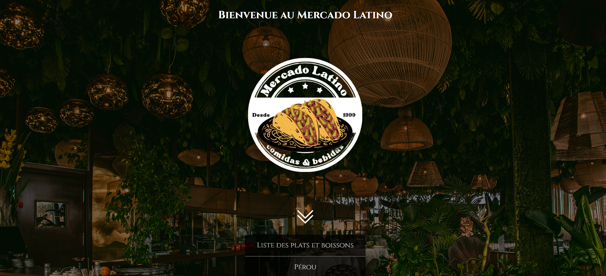

# siteScolaire

<h2>Site fictif fait pour un projet noté en première année d'étude en utilisant PHP, TwiG et MYSQL</h2>

Sur mon site, Mercado Latino, une liste de plats et boissons et répertorié. Un système filtre l'affichage des plats et boissons, sous chaque détail d'un article un commentaire peut être laissé. Un panel administrateur est mis en place pour avoir une liste de tous les commentaires afin de pouvoir les supprimer

